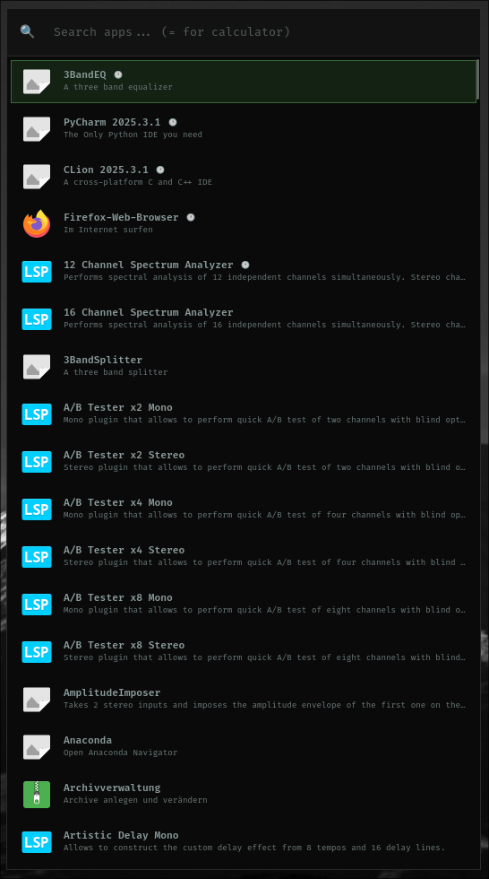

# Architecture: HyprLaunch Launcher



## Layer Stack

```
┌─────────────────────────────────────────────────────────────────┐
│ Hyprland Compositor                                             │
│   hyprlaunch.so plugin (no GTK, no threads, no blocking)        │
│     → dispatchers, IPC, fork+exec                               │
└──────────────────────┬──────────────────────────────────────────┘
                       │ fork() + execlp()
                       ▼
┌─────────────────────────────────────────────────────────────────┐
│ hyprlaunch-ui (standalone Wayland client)                        │
│   GTK4 + gtk4-layer-shell overlay window                        │
│     → app discovery, fuzzy search, calculator, helpers mode     │
└──────────────────────┬──────────────────────────────────────────┘
                       │ GDesktopAppInfo / filesystem scan
                       ▼
┌─────────────────────────────────────────────────────────────────┐
│ Desktop Apps (.desktop files) + Helper Scripts                  │
│   /usr/share/applications/  +  ~/.local/bin/helpers/            │
└─────────────────────────────────────────────────────────────────┘
```

## Dual Mode

HyprLaunch operates in two modes:

### Apps Mode (default)
- Discovers installed applications via `GDesktopAppInfo`
- Fuzzy search with weighted scoring (name × 10 > description > keywords)
- Recent apps (last 10) shown when search is empty
- Calculator mode with `=` prefix (e.g. `=2+2`)
- Launch via `g_app_info_launch()`

### Helpers Mode
- Scans `~/.local/bin/helpers/` for executable scripts
- First comment line after shebang used as description
- Interactive scripts (containing `read`, `dialog`, `whiptail`, `select`) launched in kitty terminal
- Non-interactive scripts executed directly

## Dispatchers and IPC

### Dispatchers (Hyprland keybindings)

| Dispatcher | Action |
|-----------|--------|
| `hyprlaunch:toggle` | Toggle visibility (resets to Apps mode) |
| `hyprlaunch:show` | Show launcher |
| `hyprlaunch:hide` | Hide launcher |
| `hyprlaunch:apps` | Show in Apps mode |
| `hyprlaunch:helpers` | Toggle in Helpers mode |

### IPC Commands (hyprctl)

| Command | Action |
|---------|--------|
| `hyprctl hyprlaunch:toggle` | Toggle visibility |
| `hyprctl hyprlaunch:show` | Show launcher |
| `hyprctl hyprlaunch:hide` | Hide launcher |
| `hyprctl hyprlaunch:apps` | Show in Apps mode |
| `hyprctl hyprlaunch:helpers` | Show in Helpers mode |
| `hyprctl hyprlaunch:reload` | Reload config |

### Keybindings (iconmanager templates)

| Shortcut | Dispatcher | Mode |
|----------|-----------|------|
| SUPER+SPACE | `hyprlaunch:toggle` | Apps (default) |
| SUPER+SHIFT+H | `hyprlaunch:helpers` | Helpers |

## Layer-Shell Window

- Anchored to **top-left** with margins for centering
- All 4 edges anchored → surface fills entire monitor
- Content centered via GTK align (HALIGN_CENTER, VALIGN_CENTER)
- Margins calculated: `marginLeft = (monitorWidth - windowWidth) / 2`
- Window size configured in `~/.config/hypr/hyprlaunch.toml`
- No Hyprland windowrules needed (layer-shell windows are not regular clients)

## Configuration

Config file: `~/.config/hypr/hyprlaunch.toml`

```toml
window_width = 530
window_height = 1050
```

Defaults: 550 × 550

## Plugin ↔ UI Communication

```
Plugin (hyprlaunch.so)              UI (hyprlaunch-ui)
        │                                    │
        │  fork() + execlp()                 │
        │  "hyprlaunch-ui --toggle"          │
        │ ──────────────────────────────────> │
        │                                    │
        │  (UI handles show/hide/mode        │
        │   internally via GTK4)             │
        │                                    │
```

The plugin never blocks. Each command is a fire-and-forget `fork()` + `execlp()`.
Zombie children are reaped via `waitpid(-1, nullptr, WNOHANG)` before each fork.
